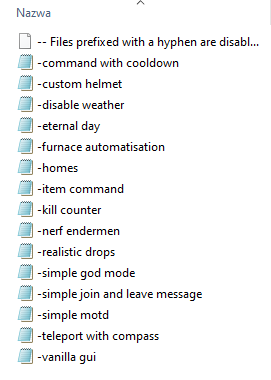

# Podstawy pisania skryptów

Witaj, w tym poradniku przedstawie Ci podstawy pisania skryptów. Jeżeli potrzebujesz pomocy, napisz do mnie na discord `JorgiTV#0177` lub pod tym projektem. Uważasz, że nie ma w poradniku jakieś ważnej funkcji? Napisz do mnie, a ja postaram się ją dodać!

## Wprowadzenie do Skript'a
Skript jest dobry dla początkujących osób. Jest on alternatywą języka Java, którego w minecraft'cie wykorzystujemy go m. in. do pisania pluginów. Całą dokumentację skrypta znajdziesz **[tutaj](https://skriptlang.github.io/Skript/index.html)**. Przydatna w pisaniu skryptów jest znajomość języka angielskiego. Podczas pisania skryptów używa się go praktycznie cały czas. Każdy skrypt zapisywany jest w formacie `.sk`, a następnie jest on czytany przez język Java. Niestety, skrypty nie są tak wydajne jak pluginy, dlatego większość nie zaleca ich używania. Jednakże, sądzę, że skrypty są dobrym rozwiązaniem na początek przygody z "programowaniem".

## Co zrobić aby, zacząć pisać skrypty?
Aby zacząć pisać skrypty, należy zaopatrzeć się w odpowiedni program. Możesz używać domyślnego notatnika, lecz na dłuższy czas, nie będzie on wygodny. Najwygodniejszym programem do pisania na początek jest **[SkIDE](https://skide.liz3.net/)**. Jest on programem, które oferuje podświetlanie składni skrypta, oraz automatyczne uzupełnianie. Program pozwala również dodawanie dodatków zarejestrowanych w **Skript Hub**. Możesz również użyć innego zamiennika np. **[NotePad++](https://notepad-plus-plus.org/downloads/)**. Zalecane jest również wybranie systemu kodowania **UTF-8**, tak aby wszystko zapisałby się poprawnie.

Aby zacząć swoją przygodę z pisaniem skryptów, należy pobrać odpowiednią wersję pluginu **[Skript](https://github.com/SkriptLang/Skript/releases)** oraz następnie wrzucić go do folderu `/plugins/` i zrestartować serwer. Po włączeniu serwera, powinien stworzyć się folder `/Skript/`, wejdź do niego a następnie przejdź do folderu `/scripts/`. W tym folderze powinny znajdować się pliki ukazane na *(Zdjęcie 1)*. Nie przydadzą Ci się one, więc możesz je usunąć.

## Podstawowe komendy pluginu Skript
- `/sk reload [all/(nazwa pliku)]` - Przeładowuje pliki twojego danego skryptu, lub wszystkich.
